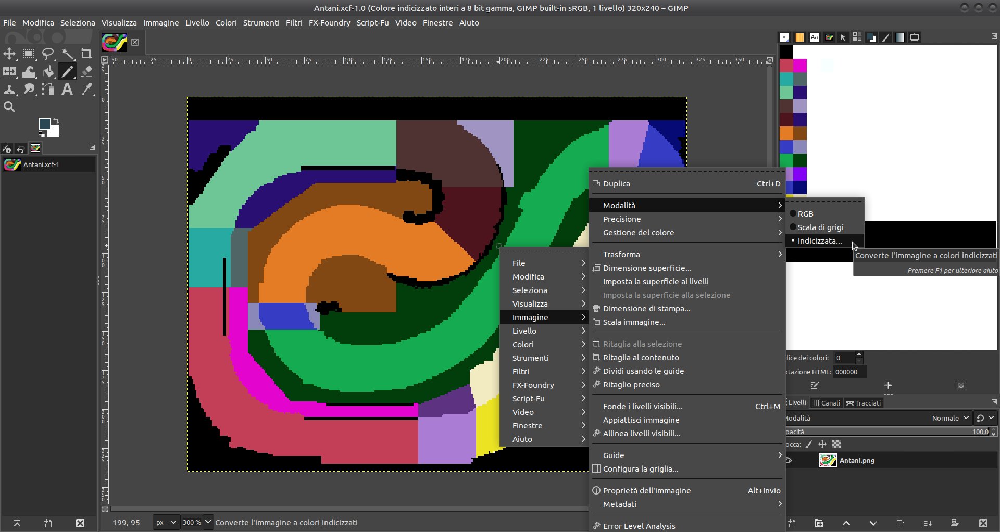
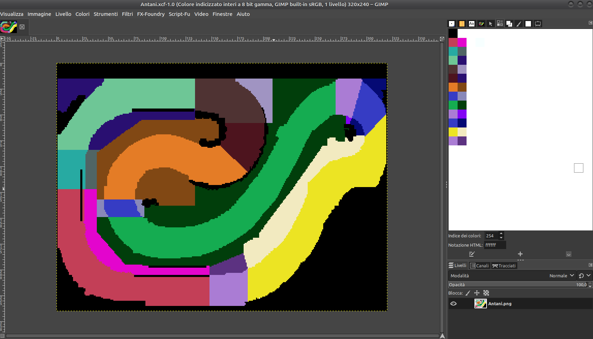
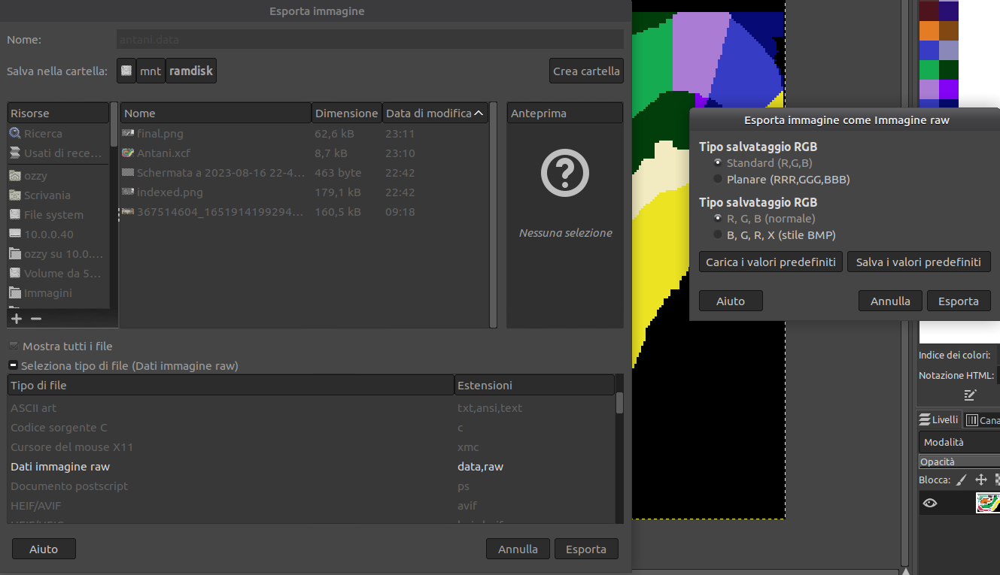
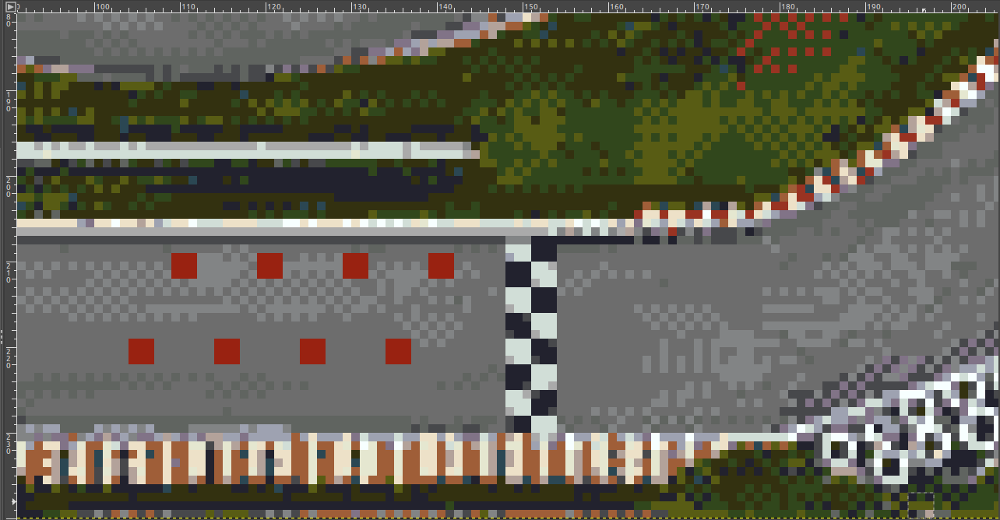

# RC track creation tutorial

This is a little tutorial on how to inport a new track inside RC game

## Initial image

Draw your track with whatever tool you like (GIMP, Deluxe Paint, doesnt really matter) following this specs:

* 320X240 pixel resolution
* 32 Colors MAX
  
And export it into IFF and PNG indexed mode.
If you are looking for a good program able to perform the conversion give a look at XnConvert.

Please make sure that the palette uses the following colors

* $DFF1A2 COLOR17   $0000
* $DFF1A4 COLOR18	$0921

* $DFF1AA COLOR21	$0000
* $DFF1AC COLOR22	$025B

* $DFF1B0 COLOR25	$0000
* $DFF1B4 COLOR26	$0DD4

* $DFF1BA COLOR29	$0000
* $DFF1BC COLOR30	$04A4

Also remember the bakground (color 0) will be automatically set by the game to gray (color code $0889)

Color 17, 21, 25, 29 are used for the outline of the car, in order to stick out from the background,
usually they are set to black or to a very dark color.

Color 18,22,26 and 30 are used to paint the inner part of the car and they cannot be changed, this color
are important to characterize/define/distingush the car team (red for Perrari or green for Alfa Marameo),
in other words you should never change this values and the track image should use this colors as less as possibile
in order to do avoid the track image to blend with the cars.

### Filesystem preparation work
Create a directory with the name of the track somewhere, I usually do it under the __assets/tracks__ directory, under the directory create 2 subdirs with the name __images__ and __metadata__, place the iff and png image there, the png image is not needed actually, it's just there for convenience since modern pc doesn't recognize IFF format out of the box.

### Convert the off image to raw planar
Yes, RC displays only raw images in planar format, for this reason you have to use a software able to perform the conversion.
I use mine which works fine on GNU/Linux operating systems which is called ilbm2raw (https://github.com/Ozzyboshi/ilbm2raw) but there are plenty others out there like XnConvert for example.

### Prepare metadata
Open the png image with GIMP, now you have to make something like a map out of it.
The map will tell the game how the cars should behave on this track. 
Make sure you set indexed mode on GIMP. 



Notice in the above picture the track has been repainted using indexed colors.

### Zones
The zone concept allows RC to force the player to follow a pre defined path without taking shortcuts.
Let's assume a track as one or more crossroads or no barriers between 2 different sections of the tracks, in this case the players could go out of the normal asphalt road and try to find a shorter way to get to the finish line.
RC checks that whenever a car changes zone, the new zone id must be incremental, in other words, if the track has 5 zones, the car must travel zone 1 2 3 4 5 in this exact order before getting to the finishline, if this doesnt occour, the lap won't be counted as valid.

### Terrain
RC so far is able to support only 3 different type of terrains:
- Asphalt
- Grass
- Ice
  
RC introduces new behaviours according to the terrain where the car is located, for example, if the car is over a grass pixel, the max speed is halved, or, if the car is over ICE, it will change the rotation and current speed to simulate a slippery road.

### Color mapping

Color 0 has a special meaning in RC, every pixel with this index means the car is not allowed to walk over this pixel.

Colors from 1 to 15 are reserved for future use, so far they are ignored by the game.
In the same fashion, the other colors tells the game how the car should behave on a particular position.
In particular, the other colors allow RC to know 2 important things:
- the zone id
- the terrain

Colors assignments:
```

Color 16 is reserved for the asphalt on zone 1.
Color 17 is reserved for the grass on zone 1.
Color 18 is reserved for the ice on zone 1.

Color 32 is reserved for the asphalt on zone 2.
Color 33 is reserved for the grass on zone 2.
Color 34 is reserved for the ice on zone 2.

Color 48 is reserved for the asphalt on zone 3.
Color 49 is reserved for the grass on zone 3.
Color 50 is reserved for the ice on zone 3.

Color 64 is reserved for the asphalt on zone 4.
Color 65 is reserved for the grass on zone 4.
Color 66 is reserved for the ice on zone 4.

Color 80 is reserved for the asphalt on zone 5.
Color 81 is reserved for the grass on zone 5.
Color 82 is reserved for the ice on zone 5.

Color 96 is reserved for the asphalt on zone 6.
Color 97 is reserved for the grass on zone 6.
Color 98 is reserved for the ice on zone 6.

Color 112 is reserved for the asphalt on zone 7.
Color 113 is reserved for the grass on zone 7.
Color 114 is reserved for the ice on zone 7.

Color 128 is reserved for the asphalt on zone 8.
Color 129 is reserved for the grass on zone 8.
Color 130 is reserved for the ice on zone 8.

Color 144 is reserved for the asphalt on zone 9.
Color 145 is reserved for the grass on zone 9.
Color 146 is reserved for the ice on zone 9.

Color 160 is reserved for the asphalt on zone 10.
Color 161 is reserved for the grass on zone 10.
Color 162 is reserved for the ice on zone 10.

Color 176 is reserved for the asphalt on zone 11.
Color 177 is reserved for the grass on zone 11.
Color 178 is reserved for the ice on zone 11.

Color 192 is reserved for the asphalt on zone 12.
Color 193 is reserved for the grass on zone 12.
Color 194 is reserved for the ice on zone 12.

Color 208 is reserved for the asphalt on zone 13.
Color 209 is reserved for the grass on zone 13.
Color 210 is reserved for the ice on zone 13.

Color 224 is reserved for the asphalt on zone 14.
Color 225 is reserved for the grass on zone 14.
Color 226 is reserved for the ice on zone 14.

Color 240 is reserved for the asphalt on zone 15.
Color 241 is reserved for the grass on zone 15.
Color 242 is reserved for the ice on zone 15.

```

Maximum number of zones allowed is 15.

Final result should be something like that

Input image:


Final image:



After creating the map image, export in raw data 8 bit and place it under the __metadata__ directory.



### Create start race placeholders

Every time a race starts, RC automatically places each car on a particular place on the track.
The coordinates where the cars starts the race of course change according to the track.
The TRK file format has a specific memory area reserved for this.
Open the PNG file with gimp, create a new layer and place 8 ponts (one for each car) near the finish line.
The 8 points must be placed on the last zone and they must have a clean view of the finish line.
Refer to the screenshot below:



Save the new image in the metadata directory just to have a reference in the future if you want to change these placeholders, then take note of all the coordinates of the red squares, we will need them shortly.

### Start scripting
In this tutorial I am going to use a Makefile in order to create the final .TRK file needed for RC, feel free to use whatever you want.

The Makfile template I use is the following, you will have to adapt it to your scripting language.

```
@# Put here the IFF filename without extension
IMAGE32COLORS = xxxx

@# Put here the output file name without extension, use only UPPERCASE letters or numbers, lenght no more than 10 charaters.
TRACKNAME = YYYY

@# Final size must be this, don't touch this
DESIRED_FILE_SIZE = 125916

all:
	ilbm2raw -f ./images/$(IMAGE32COLORS).iff ./images/$(IMAGE32COLORS).raw -p ./images/$(IMAGE32COLORS).pal

    @# Enable this only if you need bitplane padding (your image is not 32 colors)
	#dd if=/dev/zero of=./images/$(IMAGE32COLORS).raw bs=1 count=1 seek=47999
	
	@# Enable this only if you need padding on the color (it needs to be 64 bytes)
    # pad palette color for team 1
	#echo 00 00 00 00 09 21 00 00 | xxd -r -p >> ./images/$(IMAGE32COLORS).pal
	# pad palette color for team 2
	#echo 00 00 00 00 02 5b 00 00 | xxd -r -p >> ./images/$(IMAGE32COLORS).pal
	# pad palette color for team 3
	# echo 00 00 00 00 0d d4 00 00 | xxd -r -p >> ./images/$(IMAGE32COLORS).pal
	# pad palette color for team 4
	# echo 00 00 00 00 04 a4 00 00 | xxd -r -p >> ./images/$(IMAGE32COLORS).pal

	# add raw image data
	cp ./images/$(IMAGE32COLORS).raw ../../../buildadf/tracks/$(TRACKNAME).TRK

	# add palette
	cat ./images/$(IMAGE32COLORS).pal >> ../../../buildadf/tracks/$(TRACKNAME).TRK

	# add metadata
	cat ./metadata/$(IMAGE32COLORS).data >> ../../../buildadf/tracks/$(TRACKNAME).TRK

	# add starting positions (X Y and degrees of the car)
	printf "%04x%04x%04x\n" 140 200 0 | xxd -r -p >> ../../../buildadf/tracks/$(TRACKNAME).TRK
	printf "%04x%04x%04x\n" 130 210 0 | xxd -r -p >> ../../../buildadf/tracks/$(TRACKNAME).TRK
	printf "%04x%04x%04x\n" 120 200 0 | xxd -r -p >> ../../../buildadf/tracks/$(TRACKNAME).TRK
	printf "%04x%04x%04x\n" 110 210 0 | xxd -r -p >> ../../../buildadf/tracks/$(TRACKNAME).TRK
	printf "%04x%04x%04x\n" 100 200 0 | xxd -r -p >> ../../../buildadf/tracks/$(TRACKNAME).TRK
	printf "%04x%04x%04x\n" 90 210 0 | xxd -r -p >> ../../../buildadf/tracks/$(TRACKNAME).TRK
	printf "%04x%04x%04x\n" 80 200 0 | xxd -r -p >> ../../../buildadf/tracks/$(TRACKNAME).TRK
	printf "%04x%04x%04x\n" 70 210 0 | xxd -r -p >> ../../../buildadf/tracks/$(TRACKNAME).TRK

	#add CPU positions
	# Section 1
	# Section 2
	# Section 3
	# Section 4
	# Section 5
	# Section 6
	# Section 7

	# Padding CPU positions
	for number in `seq 1 250`; do \
        echo FF FF FF FF | xxd -r -p >> ../../../buildadf/tracks/$(TRACKNAME).TRK ;\
    done

	# number of zones of the track
	echo 00 07 | xxd -r -p >> ../../../buildadf/tracks/$(TRACKNAME).TRK

	# hotspot CPU distance
	echo 00 14 | xxd -r -p >> ../../../buildadf/tracks/$(TRACKNAME).TRK

	@if [ $$(stat -c %s ../../../buildadf/tracks/$(TRACKNAME).TRK) -ne $(DESIRED_FILE_SIZE) ]; then \
		echo "File $(TRACKNAME).TRK with faulty size"; \
		exit 1; \
	fi

    # Copy and compress to output dir

	cp ../../../buildadf/tracks/$(TRACKNAME).TRK ../../../bin/tracks/$(TRACKNAME).TRK
	chmod 777 ../../../bin/tracks/$(TRACKNAME).TRK
	cd ../../../bin/tracks && ../../Shrinkler --data $(TRACKNAME).TRK ../tracksshr/$(TRACKNAME).TRK && chmod 666 ../tracksshr/$(TRACKNAME).TRK
	cp -p ../../../bin/tracksshr/$(TRACKNAME).TRK ../../../buildadf/tracksshr/$(TRACKNAME).TRK
    ```

